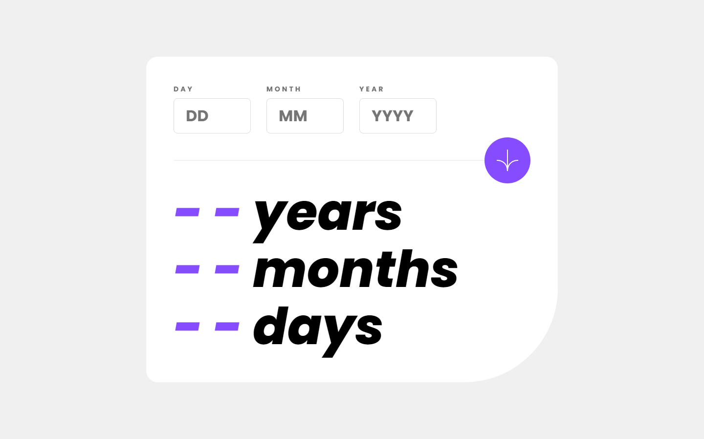

# Frontend Mentor - Age calculator app solution

This is a solution to the [Age calculator app challenge on Frontend Mentor](https://www.frontendmentor.io/challenges/age-calculator-app-dF9DFFpj-Q). Frontend Mentor challenges help you improve your coding skills by building realistic projects. 

## Table of contents

- [Overview](#overview)
  - [The challenge](#the-challenge)
  - [Screenshot](#screenshot)
  - [Links](#links)
- [My process](#my-process)
  - [Built with](#built-with)
  - [What I learned](#what-i-learned)
  - [Continued development](#continued-development)
  - [Useful resources](#useful-resources)
- [Author](#author)

## Overview

### The challenge

Users should be able to:

- View an age in years, months, and days after submitting a valid date through the form
- Receive validation errors if:
  - Any field is empty when the form is submitted
  - The day number is not between 1-31
  - The month number is not between 1-12
  - The year is in the future
  - The date is invalid e.g. 31/04/1991 (there are 30 days in April)
- View the optimal layout for the interface depending on their device's screen size
- See hover and focus states for all interactive elements on the page
- **Bonus**: See the age numbers animate to their final number when the form is submitted

### Screenshot



### Links

- HTML Solution: [HTML](https://github.com/JustANipple/age-calculator-app/blob/master/index.html)
- SCSS Solution: [SCSS](https://github.com/JustANipple/age-calculator-app/blob/master/styles/main.scss)
- JS Solution: [JS](https://github.com/JustANipple/age-calculator-app/blob/master/script/script.js)
- Live Site URL: [LIVE](https://justanipple.github.io/age-calculator-app/)

## My process

### Built with

- Semantic HTML5 markup
- CSS custom properties
- Flexbox
- CSS Grid
- Mobile-first workflow
- SCSS components
- JavaScript

### What I learned

I needed to animate age numbers for the bonus challenge, so i started working with promises.
At first it was a little bit confusing, but then i managed to create my async function that calls another function and awaits until the setTimeout method has ended:

To see how you can add code snippets, see below:

```js
async function setAge() {
    const birthDate = new Date(year.value, month.value -1, day.value);
    const age = new Date(currentDate - birthDate);

    ageYears.textContent = "0";
    ageMonths.textContent = "0";
    ageDays.textContent = "0";

    const agedYears = age.getUTCFullYear() - 1970;
    for(let i = 0; i < agedYears; i++) {
        await animateNum(ageYears);
    }

    const agedMonths = age.getUTCMonth();
    for(let i = 0; i < agedMonths; i++) {
        await animateNum(ageMonths);
    }
    
    const agedDays = age.getUTCDate() -1;
    for(let i = 0; i < agedDays; i++) {
        await animateNum(ageDays);
    }
}

function animateNum(ageObj) {
    return new Promise((resolve) => {
        setTimeout(() => {
            resolve(ageObj.textContent = parseInt(ageObj.textContent) + 1);
        }, 20);
    });
}
```

### Continued development

Promises are still a bit confusing, so i am going to practice more

### Useful resources

- [async and await](https://developer.mozilla.org/en-US/docs/Learn/JavaScript/Asynchronous/Implementing_a_promise-based_API#using_async_and_await_with_the_alarm_api) - This part of the MDN guide helped me to make an animation for age numbers

## Author

- Frontend Mentor - [@JustANipple](https://www.frontendmentor.io/profile/JustANipple)
